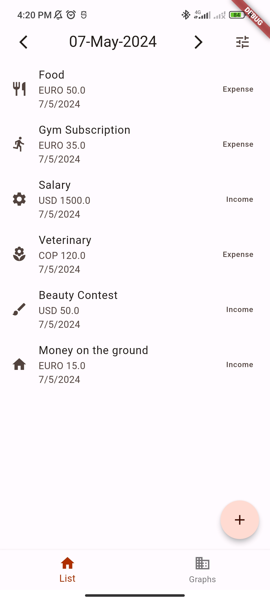

# Money Tracker

Money Tracker is a comprehensive Flutter application designed to help users efficiently track their daily personal finances directly from their smartphones. This app serves as an excellent resource for learning about Flutter, focusing on custom widget creation, page management, and local data storage.

## Features

- **Daily Expense Management**: Log and manage daily expenses with ease.
- **Multi-Currency Support**: Cater to global users with multiple currency options.
- **Local Storage**: Ensures user data is stored safely on the device.
- **User Settings**: Manage settings and configurations easily.

## Getting Started

### Prerequisites

Ensure you have Flutter installed on your machine. For Flutter installation guidance, refer to the [official documentation](https://docs.flutter.dev/get-started/install).

### Downloading

1. Clone the repository to your local machine using:

```
git clone https://github.com/JuanJoseJ/money_tracker
```

2. Navigate to the project directory:

```
cd money_tracker
```

### Running and Debugging

1. Run the following command to fetch the project dependencies:

```
flutter pub get
```

2. Start the application in Debug mode:

```
flutter run
```

For a detailed debugging guide, visit the [Flutter debugging documentation](https://docs.flutter.dev/testing/debugging).

## Contributing

We welcome contributions to the Money Tracker! Here's how you can contribute:

1. Fork the project repository.
2. Create your feature branch (`git checkout -b feature/AmazingFeature`).
3. Commit your changes (`git commit -m 'Add some AmazingFeature'`).
4. Push to the branch (`git push origin feature/AmazingFeature`).
5. Open a Pull Request.

## Future Features

- **Income vs. Expense Reports**: Visualize your financial health with detailed reports.
- **Budget Planning**: Tools to set and manage monthly budgets.
- **Cloud Sync**: Option to backup and sync data across multiple devices.
- **Custom Alerts**: Set alerts for budget limits and bill payments.
- **Enhanced Security**: Implement biometric authentication to access the app.

## Learned Technologies

In developing this project, we integrated several key Flutter packages to enhance functionality and improve the user experience. Below is a breakdown of the major dependencies and their roles:

- **Provider**: A state management library used to manage data flow and app state across different parts of our application efficiently.
- **Hive**: Utilized for local database management of the money movements; it's a lightweight and blazing fast key-value database.
- **Shared Preferences**: Used for storing simple data persistently across app launches, ideal for saving user preferences and settings.

## Gallery

<p align="center">
  
  
  
</p>

